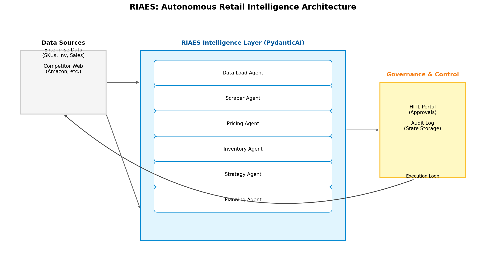

# RIAES: Autonomous Retail Intelligence for Autonomous Decisioning & Execution

RIAES (Retail Intelligence Autonomous Execution System) is an Agentic AI-powered platform that unifies enterprise data with advanced optimization capabilities to drive real-time, closed-loop decisions across pricing, assortment, promotions, and operations.

## Features

- **Agentic AI Layer**: 9 specialized agents (Pricing, Inventory, Strategy, Assortment, etc.) built with **PydanticAI**.
- **Independent Scraper Agent**: API-accessible web scraper with template-based logic for major retailers (Amazon, Walmart, Target, Dick's).
- **Governance Hub**: Human-in-the-Loop (HITL) portal for approving AI-generated decisions.
- **Enterprise Integration**: Unified data models for Products, Inventory, and Competitor Intelligence.

## Tech Stack

- **FastAPI**: Backend API and Portal.
- **PydanticAI**: Agentic framework.
- **SQLAlchemy**: ORM with SQLite database.
- **Tailwind CSS**: Responsive Governance Portal.
- **Matplotlib**: Architecture visualization.

## Architecture



## Getting Started

### Installation

```bash
pip install -r requirements.txt
```

### Initializing the Database

```bash
PYTHONPATH=. python3 riaes/scripts/init_db.py
PYTHONPATH=. python3 riaes/scripts/generate_data.py
```

### Running the Platform

```bash
uvicorn main:app --host 0.0.0.0 --port 8000
```

Access the Portal at `http://localhost:8000/portal/`

## API Usage

### 1. Trigger an Agent
```bash
curl -X POST "http://localhost:8000/api/v1/agents/pricing/run?sku=DSG-1001"
```

### 2. Use the Scraper Agent
```bash
curl -X POST "http://localhost:8000/api/v1/scraper/scrape" \
     -H "Content-Type: application/json" \
     -d '{"url": "https://www.amazon.com/product/123"}'
```
